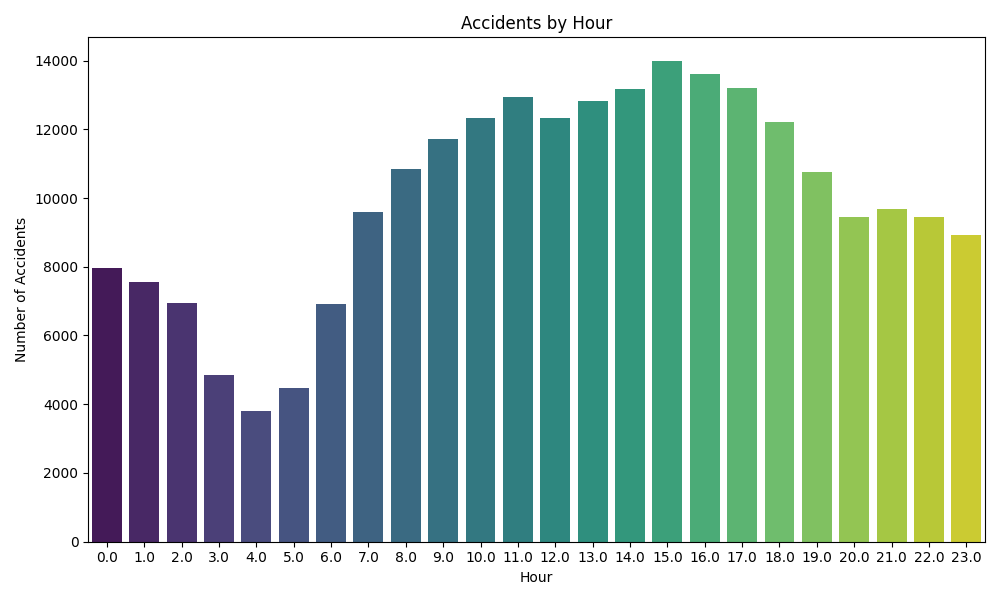

# Data Science Task 05: Traffic Accident Data Analysis

## 📝 Overview

This project analyzes traffic accident data to identify patterns related to road conditions, weather, and time of day. The analysis includes visualizing accident hotspots and contributing factors using exploratory data analysis (EDA) techniques. Various plots are generated and saved to understand accident distribution by hour, day, and location.

The dataset used is publicly available from Kaggle:

* Dataset: [US Highway-Rail Grade Crossing Accident Data](https://www.kaggle.com/code/harshalbhamare/us-accident-eda)

---

##  Objective

The main objectives of this project are to:

* Load and explore the traffic accident dataset.
* Process date and time information to extract insights.
* Analyze accident counts by hour of day and day of the week.
* Identify locations with the highest number of accidents.
* Visualize accident types and contributing factors.
* Save all generated plots for reporting and sharing.

---

##  Steps to Execute

1. **Clone the Repository**:
   Clone this repository to your local machine using:

   ```bash
   git clone https://github.com/Shreyabagal/PRODIGY_DS_05.git
   ```

2. **Install Dependencies**:
   Install the required Python libraries using:

   ```bash
   pip install -r requirements.txt
   ```

3. **Run the Script**:
   Execute the Python script to perform the analysis and generate visualizations:

   ```bash
   python us_accidents_analysis.py
   ```

4. **Output**:
   The generated plots will be saved inside the `images/` folder, for example:

   ```
   images/accidents_by_hour.png  
   images/accidents_by_day.png  
   images/top_citys.png  
   images/accidents_by_type.png  
   ```

---

## 📊 Visualizations

Here are some examples of saved visualizations from the analysis:




*(Note: Images will be available inside the `images/` folder after running the script.)*

---

## 🔍 Explanation of the Code

The Python script (`us_accidents_analysis.py`) includes:

1. **Data Loading**: Reads accident data from the CSV file.
2. **Date-Time Processing**: Converts date and time columns for temporal analysis.
3. **Visualization**: Generates bar plots for accidents by hour, day, top cities/counties, and accident types.
4. **Image Saving**: Saves all plots as `.png` files in the `images/` directory.

---

## 💻 Technologies Used

* Python
* Pandas
* Matplotlib
* Seaborn
* OS (for directory management)

---

## 📁 File Structure

```
PRODIGY_DS_05/
├── Highway-Rail_Grade_Crossing_Accident_Data.csv    # Input dataset
├── us_accidents_analysis.py                          # Python script for analysis and visualization
├── images/                                          # Folder containing saved plots (output)
│   ├── accidents_by_hour.png
│   ├── accidents_by_day.png
│   ├── top_citys.png
│   └── accidents_by_type.png
├── requirements.txt                                 # Python dependencies
├── README.md                                        # Project documentation
```


